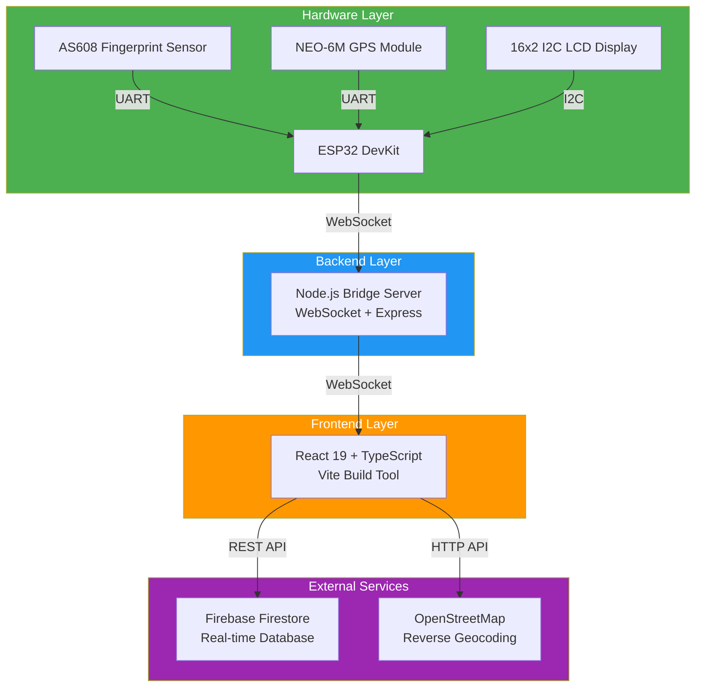

# 🔐 Biometric Attendance System with GPS Tracking

> A real-time, GPS-enabled fingerprint attendance system combining ESP32 hardware, React frontend, and Firebase backend for secure, location-verified attendance management.

[](https://opensource.org/licenses/MIT)
[](https://reactjs.org/)
[](https://www.typescriptlang.org/)
[](https://firebase.google.com/)

---

## 🎯 Overview

This **Biometric Attendance System** is an IoT solution designed for educational institutions to eliminate proxy attendance and ensure location-verified check-ins. Developed as an undergraduate final year project at the Federal University of Technology, Owerri (FUTO), Nigeria, it was inspired by the need for transparent and tamper-proof attendance systems observed during the 2023 Nigerian elections.

### 🌟 Key Features

- **🔒 Secure Authentication**: Fingerprint-based biometric verification using AS608 sensor
- **📍 GPS Verification**: Real-time location tracking with NEO-6M GPS module
- **🗺️ Smart Geocoding**: Automatic reverse geocoding to human-readable addresses via OpenStreetMap
- **⚡ Real-time Updates**: WebSocket-based live attendance broadcasting
- **📊 Analytics Dashboard**: Comprehensive attendance statistics and reporting
- **🎨 Modern UI**: Glassmorphic design with smooth animations and responsive layout
- **🛰️ GPS Status Monitoring**: Visual satellite count and signal strength indicators

---

## 🏗️ System Architecture



### How It Works

1. **Fingerprint Capture** → ESP32 reads fingerprint via AS608 sensor
2. **GPS Acquisition** → NEO-6M module provides real-time coordinates
3. **WebSocket Transmission** → ESP32 sends data to Node.js bridge server
4. **Real-time Broadcast** → Updates pushed to all connected web clients
5. **Database Persistence** → Attendance record saved to Firebase Firestore
6. **Location Resolution** → OpenStreetMap API converts coordinates to human-readable addresses

---

## 🛠️ Technology Stack

### Frontend
- **React** 19.2.0 - UI framework with hooks and context
- **TypeScript** 5.8.2 - Type-safe development
- **Vite** 6.2.0 - Fast build tool and dev server
- **React Router** 7.9.4 - Client-side routing
- **Firebase SDK** 12.4.0 - Database integration

### Backend
- **Node.js** 16+ - Runtime environment
- **Express** 5.2.1 - HTTP server framework
- **WebSocket (ws)** 8.18.3 - Real-time bidirectional communication

### Hardware
- **ESP32 DevKit** - WiFi-enabled microcontroller (240MHz dual-core)
- **AS608 Fingerprint Sensor** - Optical sensor, 500 DPI, UART interface
- **NEO-6M GPS Module** - u-blox GPS with -161 dBm sensitivity
- **16x2 I2C LCD Display** - Status display with HD44780 controller

### Cloud Services
- **Firebase Firestore** - NoSQL real-time database
- **OpenStreetMap Nominatim** - Free reverse geocoding API

---

## 🎓 Project Background

### Problem Statement

Traditional attendance systems in educational institutions face several challenges:
- **Proxy Attendance**: Students signing in for absent peers
- **Location Fraud**: Attendance marked from unauthorized locations
- **Manual Errors**: Human error in record-keeping
- **Lack of Transparency**: No verifiable audit trail

### Solution

This system addresses these challenges through:
1. **Biometric Verification** - Eliminates proxy attendance via fingerprint authentication
2. **GPS Tracking** - Ensures students are physically present at the correct location
3. **Real-time Monitoring** - Provides instant visibility into attendance data
4. **Automated Geocoding** - Converts GPS coordinates to human-readable locations
5. **Immutable Records** - Firebase Firestore ensures tamper-proof data storage

---

## 📄 License

This project is licensed under the **MIT License**.

Copyright (c) 2024 Nder Anthony

Permission is hereby granted, free of charge, to any person obtaining a copy
of this software and associated documentation files (the "Software"), to deal
in the Software without restriction, including without limitation the rights
to use, copy, modify, merge, publish, distribute, sublicense, and/or sell
copies of the Software, and to permit persons to whom the Software is
furnished to do so, subject to the following conditions:

The above copyright notice and this permission notice shall be included in all
copies or substantial portions of the Software.
```

---
